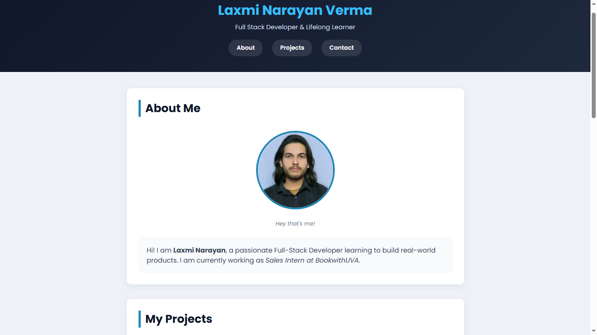

# 👨‍💻 Personal Portfolio Website

A simple and responsive **Personal Portfolio Website** built using **HTML** and **CSS**  as part of my Full Stack Web Development learning journey. This project showcases my introduction, skills, projects, and contact information.

## 📸 Preview

> 

## ✨ Features

* Personal introduction section
* Navigation menu
* About Me section
* Projects showcase
* Skills list
* Intro video section
* Contact information
* Contact form
* Semantic HTML5 structure
* External links to GitHub and LinkedIn

## 🛠️ Built With

* HTML5
* CSS

## 📂 Project Structure

```text
portfolio-website/
│── media/
│     ├── introVideo.mp4
│     ├── laxmi.jpg
│     └── portfolio-preview.png
│
│── index.html
│── README.md
└── style.css
```

## 📖 What I Learned

While building this project, I practiced:

* HTML document structure
* Semantic HTML tags
* Internal page navigation using anchor links
* Images and figure elements
* Lists
* Forms and input elements
* Video embedding
* External links
* Organizing a webpage into sections

## 📌 Featured Projects

* Personal Portfolio Website
* Weather Dashboard (Python)

## 📬 Contact

**Laxmi Narayan Verma**

* 📧 Email: [lakshminarayanverma91@gmail.com](mailto:lakshminarayanverma91@gmail.com)
* 💼 LinkedIn: https://www.linkedin.com/in/laxmi-narayan-verma-b91634379/
* 💻 GitHub: https://github.com/lakshminarayanverma91-bot

## 🌱 Learning Journey

This project is one of my beginner projects created while learning **Full Stack Web Development (MERN Stack)**. It helped me strengthen my understanding of HTML fundamentals before moving on to CSS and JavaScript.

---

⭐ If you like this project, feel free to star the repository!
